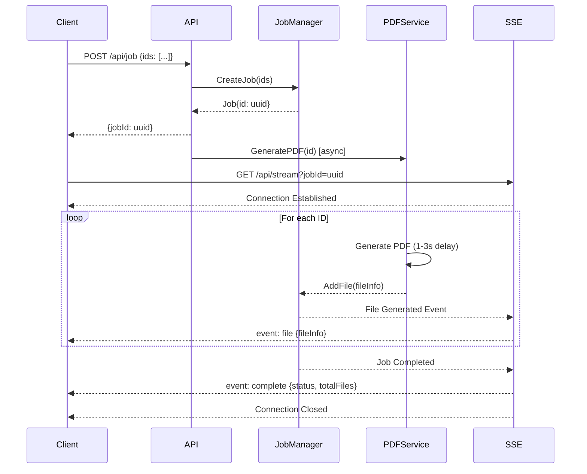

# SSE PDF Generator

GoでServer-Sent Events (SSE)を使用したPDF生成ストリーミングAPIの実装サンプルです。

## 概要

このプロジェクトは、複数のPDFファイルを非同期で生成し、その進捗をリアルタイムでクライアントに通知するシステムです。ジョブID方式を採用し、Server-Sent Eventsを使用してストリーミング配信を実現しています。

## 主な機能

- **ジョブベースの非同期処理**: UUIDによるジョブ管理で複数のリクエストを並行処理
- **リアルタイムストリーミング**: SSEを使用したPDF生成状況のリアルタイム配信
- **バッチPDF生成**: 複数IDを一括で処理し、個別にPDFを生成
- **Web UI**: ブラウザから動作確認できる直感的なインターフェース
- **擬似遅延**: 各PDF生成に1〜3秒のランダムな遅延を追加（デモ用）

## 技術スタック

- **言語**: Go 1.21+
- **Webフレームワーク**: Gorilla Mux
- **PDF生成**: gofpdf
- **ジョブID生成**: Google UUID
- **フロントエンド**: Vanilla JavaScript + SSE API

## プロジェクト構造

```
sse-sample/
├── cmd/
│   └── server/
│       └── main.go         # アプリケーションエントリーポイント
├── internal/
│   ├── handler/
│   │   └── sse.go          # SSEハンドラー（HTTPエンドポイント）
│   ├── service/
│   │   ├── job_manager.go  # ジョブ管理サービス
│   │   └── pdf_service.go  # PDF生成サービス
│   └── model/
│       └── job.go          # データモデル定義
├── static/
│   └── index.html          # Web UI
├── generated/              # 生成されたPDFの保存先
├── go.mod                  # Go依存関係
├── go.sum                  # 依存関係のチェックサム
└── README.md               # このファイル
```

## セットアップ

### 前提条件

- Go 1.21以上がインストールされていること
- Gitがインストールされていること（オプション）

### インストール手順

1. リポジトリのクローンまたはダウンロード
```bash
git clone <repository-url>
cd sse-sample
```

2. 依存関係のインストール
```bash
go mod tidy
```

3. サーバーの起動
```bash
go run cmd/server/main.go
```

4. ブラウザでアクセス
```
http://localhost:8080
```

## 使い方

### Web UIでの操作

1. ブラウザで `http://localhost:8080` にアクセス
2. IDリスト入力欄にカンマ区切りでIDを入力（例: `doc001, doc002, doc003`）
3. 「PDF生成開始」ボタンをクリック
4. リアルタイムでPDF生成の進捗が表示される
5. 全てのPDFが生成されると完了メッセージが表示

### API経由での操作

#### 1. ジョブの作成

```bash
curl -X POST http://localhost:8080/api/job \
  -H "Content-Type: application/json" \
  -d '{"ids": ["doc001", "doc002", "doc003"]}'
```

レスポンス例:
```json
{
  "jobId": "123e4567-e89b-12d3-a456-426614174000"
}
```

#### 2. SSEストリーミングの受信

```bash
curl -N http://localhost:8080/api/stream?jobId=123e4567-e89b-12d3-a456-426614174000
```

## API仕様

### POST /api/job
ジョブを作成し、PDF生成を開始します。

**リクエスト:**
```json
{
  "ids": ["string"]  // PDF生成対象のIDリスト
}
```

**レスポンス:**
```json
{
  "jobId": "string"  // 生成されたジョブID
}
```

### GET /api/stream?jobId={jobId}
指定したジョブのSSEストリームに接続します。

**パラメータ:**
- `jobId`: ジョブID（必須）

**イベントタイプ:**

1. **file イベント**
   - 個別のPDF生成完了時に送信
   ```json
   {
     "id": "doc001",
     "fileName": "document_doc001_1234567890.pdf",
     "filePath": "./generated/document_doc001_1234567890.pdf",
     "fileSize": 2048,
     "createdAt": "2024-01-01T12:00:00Z",
     "status": "success"
   }
   ```

2. **complete イベント**
   - 全PDF生成完了時に送信
   ```json
   {
     "status": "completed",
     "totalFiles": 3
   }
   ```

## 処理フロー



## 開発

### ビルド

```bash
# 実行ファイルのビルド
go build -o server cmd/server/main.go

# 実行
./server
```

### テスト

```bash
# テストの実行（テストが実装されている場合）
go test ./...
```

## カスタマイズ

### PDF生成遅延の調整

`internal/service/pdf_service.go` の以下の部分を変更:
```go
// 擬似的な処理時間を追加（1〜3秒のランダムな遅延）
delay := time.Duration(rand.Intn(2000)+1000) * time.Millisecond
```

### ポート番号の変更

`cmd/server/main.go` の以下の部分を変更:
```go
if err := http.ListenAndServe(":8080", r); err != nil {
```

### PDF出力先の変更

`cmd/server/main.go` の以下の部分を変更:
```go
pdfService := service.NewPDFService("./generated")
```

## トラブルシューティング

### ポート8080が使用中の場合
他のアプリケーションがポート8080を使用している場合は、ポート番号を変更するか、使用中のアプリケーションを停止してください。

### PDFが生成されない場合
- `generated/` ディレクトリの書き込み権限を確認
- エラーログを確認（サーバーコンソール）

### SSE接続が切断される場合
- プロキシやファイアウォールの設定を確認
- ブラウザの開発者ツールでネットワークエラーを確認

## ライセンス

MIT License

## 貢献

プルリクエストを歓迎します。大きな変更の場合は、まずissueを開いて変更内容について議論してください。